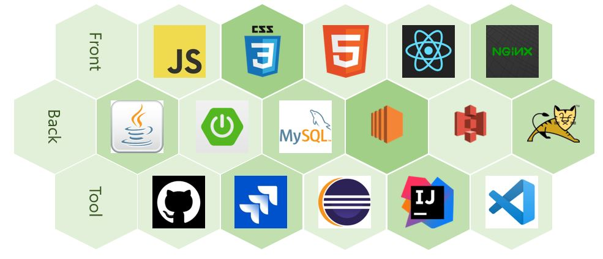

# Welcome to Leeting

>Leeting 웹 로고

 

## 👩‍💻팀원소개

**Back-End**

- 한 진 영(Back-End), 천 영 재(Back-End), 현 수 진(Back-End)

**Front-End**

- 이 홍 덕(Front-End), 정 현 모(Front-End)

**사라진 자**

- 이 홍 구(Back-End)

 

## 🎞 프로젝트 개요

- **진행 기간** : 2020.01.06 ~ 2020.02.19
- **목표 및 기대효과**
  - 무료유료 선택의 다양성 + 접근성
  - 카테고리별 검색 가능
  - 회원 인증 시스템(이메일을 통한)
  - 평가 시스템 > 어뷰징 유저 필터링
  - 지역 무관 온라인상으로 스터디/취미활동 가능
  - 온라인 활동을 통한 방역효과
  - 장기화된 코로나 사태에 따른 정신적 피로감 해소
  - 참여한 미팅 기록을 통한 미팅 추천 시스템

 

## ✨ 주요 기능

### Leeting

> 사용자들 간에 Lan선을 통한 Meeting

- Leeting
  - 원하는 모임이 있는 경우 Leeting 등록
  - 썸네일과 부제목을 통한 유저 흥미도 유도
  -  참여한 모임에 따른 추천, 현재 인기있는 모임 추천
  -  웹엑스링크를 통하여 화상대화 편의성 제공
  - 어뷰징 시스템
    - Leeting 내 이상 유저의 경우 신고 가능
    - 여러번 신고 당했을 경우 계정 정지 가능
  - 리뷰
    - Leeting을 참여한 사람에 의해서 리뷰 작성 가능

### Contents

> Leeting을 알리고 싶을 때 사용하는 컨텐츠 페이지

- 개발 진행 중

 

## 🏆 기술스택

